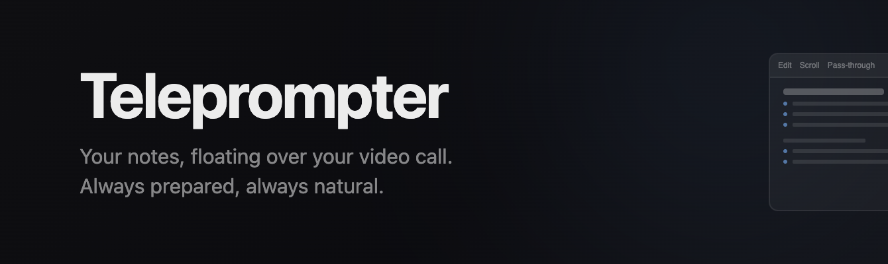
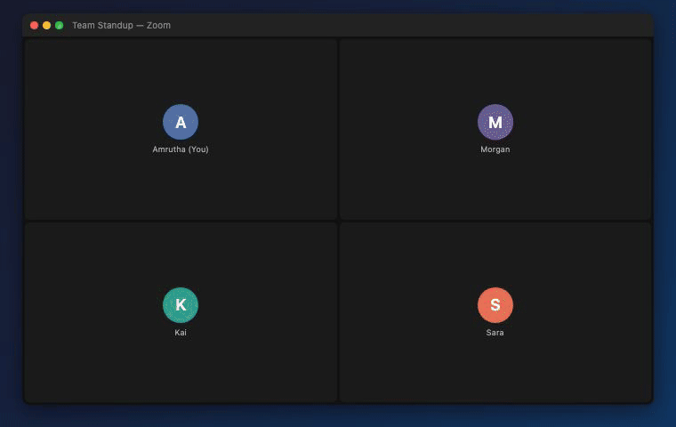
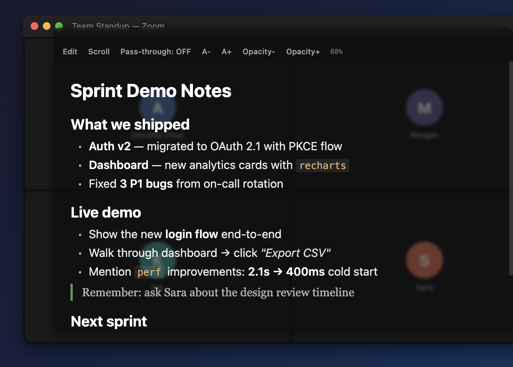

<p align="center">
  
</p>

<p align="center">
  <a href="#getting-started">Getting Started</a> &middot;
  <a href="#features">Features</a> &middot;
  <a href="#controls">Controls</a> &middot;
  <a href="#markdown">Markdown</a> &middot;
  <a href="#license">License</a>
</p>

<p align="center">
  
  
  
</p>

<br />

---

<br />

<p align="center">
  
</p>

<br />

---

<br />

## What is Teleprompter?

A transparent, always-on-top overlay that lets you read your notes while looking directly at the camera during video calls. It floats above Zoom, Meet, Teams, or any other app. You stay prepared, you stay natural.

Write your talking points in Markdown, adjust the opacity so your video call shows through, and hit Scroll for hands-free teleprompter mode. Your notes, window position, and preferences are saved automatically between sessions.

No accounts, no internet, no installation wizards.

## Install

**[Download Teleprompter.dmg](https://github.com/amrutha97/teleprompter/releases/latest/download/Teleprompter.dmg)** — open the DMG, drag to Applications, done.

> **Important:** macOS blocks apps downloaded from the internet that aren't notarized. After downloading, open Terminal and run:
> ```
> xattr -cr ~/Downloads/Teleprompter.dmg
> ```
> Then open the DMG and drag to Applications. This only needs to be done once.

## Build from Source

If you prefer to build it yourself, you need Xcode Command Line Tools:

```bash
xcode-select --install
```

Then build and run:

```bash
./build.sh
open Teleprompter.app
```

To install to Applications:

```bash
cp -r Teleprompter.app /Applications/
```

The overlay appears immediately, pinned above all windows, with a **T** icon in your menu bar.

## Features

- **Always on top** stays above Zoom, Meet, Teams, and every other window
- **Transparent overlay** adjust opacity from 12% to 100% so your call shows through
- **Pass-through mode** click straight through the overlay to interact with windows underneath
- **Auto-scroll** hands-free scrolling that pauses when it reaches the bottom
- **Markdown rendering** headings, bold, italic, inline code, blockquotes, bullets, numbered lists
- **Auto-save** notes, window position, size, font size, and opacity persist between sessions
- **Menu bar control** toggle visibility and pass-through mode from the system tray
- **Resizable and draggable** position it wherever works best for your setup

## Controls

| Action | Button | Description |
|---|---|---|
| Edit / Save | `Edit` | Toggle between rendered view and raw Markdown editor |
| Auto-scroll | `Scroll` | Start hands-free scrolling, pauses at the end |
| Pass-through | `Pass-through` | Click through the overlay to interact with windows beneath |
| Font size | `A+` / `A-` | Scale text between 10pt and 60pt |
| Opacity | `Opacity+` / `Opacity-` | Adjust window transparency |

## Markdown

The built-in renderer supports the subset of Markdown that makes sense on a teleprompter:

- `# Heading`, `## Heading`, `### Heading`
- `**bold**` and `*italic*`
- `` `inline code` ``
- `- bullet` and `1. numbered` lists
- `> blockquotes`
- `---` horizontal rules

## Privacy

Teleprompter makes zero network requests. Your notes are stored locally in `~/Library/Application Support/Teleprompter/` and nowhere else.

## Requirements

- macOS 12+ (Monterey or later)
- Swift 5.7+ (included with Xcode Command Line Tools)

<br />

---

<br />

<p align="center">
  
</p>

<br />

---

## License

[MIT](LICENSE)
